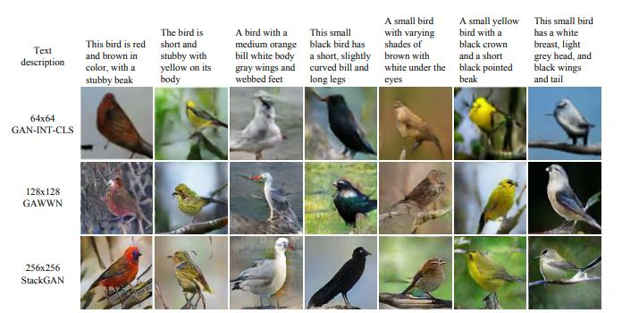
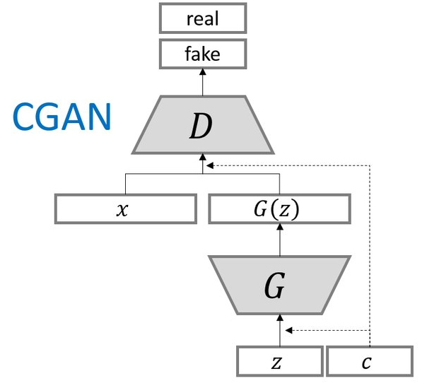

# Proposal 

## Motivation

In this project we will solve problem of generating images from text description by Deep Convolutional 
Generative Adversarial Network (GAN). Today GANs are very interesting field of research, because they 
belong to the set of generative models. It means that they are able to generate new content, what is 
kind of magic. We know about using of GANs in several fields, but creating new images from text 
description is an exciting idea in computer science today. 

Creating images from text has many real life application. It enables for example creating new characters
in cartoons or video games, drawing illustration into the books, or even creating phantom images of 
criminals according to witnesses' description. 

## Related work

Generating images according to text description is mainly reached by GANs, but the existing models often 
suffer from training problems because of instability and mode collapse. However, new and new approaches are
developing, and nowadays we are able to generate photorealistic images from short text description.

In [1] two neural networks were used, where the first layer creates an image with primitive shapes 
and colors according to text description, and the second layer creates a surprisingly realistic images.

To solve the problems with instability during the training process it's possible to use 
Multi-Scale Gradient Generative Adversarial Networks (NSG-GAN)[2]. This approach allows the flow of gradients from the
discriminator to the generator at multiple scales. 

- [Conditional GAN](https://golden.com/wiki/Conditional_generative_adversarial_network_(cGAN)
 
 
## Datasets

We identified several datasets with available data for our experiments. Datasets usually contains images with objects 
and theirs labels or text description. We will describe then more precisely below. 

#### [COCO dataset](http://cocodataset.org/#home)

#### [Open images](https://storage.googleapis.com/openimages/web/index.html)

#### [Flowers](http://www.robots.ox.ac.uk/~vgg/data/flowers/102/)

## High-Level Solution Proposal 

As we mentioned above, we will try to generate images from text. As architecture of the model we proposed Conditional 
generative adversarial network (cGAN) is an extension GAN. You can see the architecture on the picture bellow.

  

The architecture is comprised of generator and discriminator model. The generator model is responsible for 
generating new examples that ideally are indistinguishable from real examples in the dataset. 
The discriminator model is responsible for classifying a given image as either real
or fake (generated). Input to generator is vector that will be created from
random noise and Word2Vec encoding of image label or image description. This implementation will be build on top of 
[DCGAN in Tensorflow](https://www.tensorflow.org/tutorials/generative/dcgan). 

We plan build our model in experiments:
1. We will train prototype of model with Mnist dataset. This will be entry point that our model works properly.
2. In the next step we will prepare our data from either COCO or Openimage dataset. We will select images from set of 
several classes to avoid big complexity. Then we will tune and train our model to generate most reasonable images.
3. As a third experiment we would like to use data challenge from Openimage dataset. This challenge offers images with 
relations of two objects in image (man at horse, etc ...).  In case it wouldn't be out of scope we will implement 
generation of images with two objects.    

### References

[1] Han Zhang, Tao Xu, Hongsheng Li, Shaoting Zhang, Xiaogang Wang, Xiaolei Huang, Dimitris Metaxas:
StackGAN: Text to Photo-realistic Image Synthesis with Stacked Generative Adversarial Networks, 
2017 IEEE International Conference on Computer Vision (ICCV), 2016

[2] Animesh Karnewar, Oliver Wang, Raghu Sesha Iyengar:
MSG-GAN: Multi-Scale Gradient GAN for Stable Image Synthesis,
ArXiv, 2019