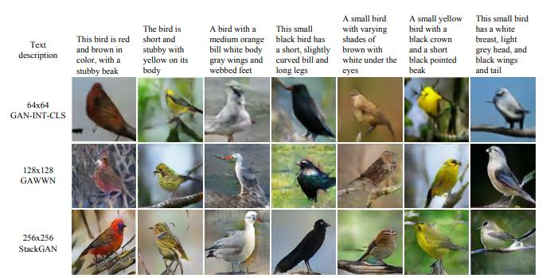
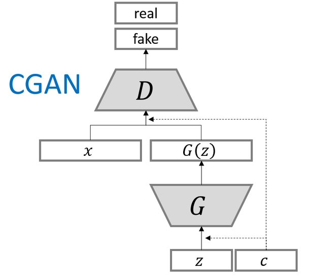
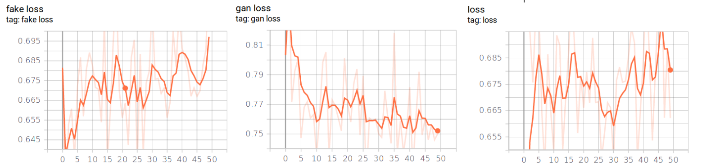
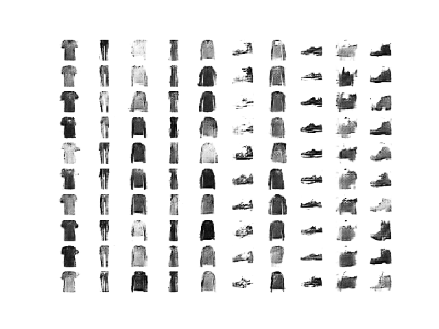

# Proposal 

## Motivation

In this project we will solve problem of generating images from text description by Deep Convolutional 
Generative Adversarial Network (GAN). Today GANs are very interesting field of research, because they 
belong to the set of generative models. It means that they are able to generate new content, what is 
kind of magic. We know about using of GANs in several fields, but creating new images from text 
description is an exciting idea in computer science today. 

Creating images from text has many real life application. It enables for example creating new characters
in cartoons or video games, drawing illustration into the books, or even creating phantom images of 
criminals according to witnesses' description. 

## Related work

Generating images according to text description is mainly reached by GANs, but the existing models often 
suffer from training problems because of instability and mode collapse. However, new and new approaches are
developing, and nowadays we are able to generate photorealistic images from short text description.

The paper [1] talks about training a deep convolutional generative adversarial net-work (DC-GAN) conditioned 
on text features.

In [2] two neural networks were used, where the first layer creates an image with primitive shapes 
and colors according to text description, and the second layer creates a surprisingly realistic images.



To solve the problems with instability during the training process it's possible to use 
Multi-Scale Gradient Generative Adversarial Networks (NSG-GAN)[3]. This approach allows the flow of gradients from the
discriminator to the generator at multiple scales. 

Another improvement of GANs are Conditional generative adversarial networks (cGAN). In GANs there is no way
to control the types of images that are generated other than trying to figure out the 
complex relationship between the latent space input to the generator and the generated images.
By conditioning the cGAN model on additional information it is possible to direct the data generation process, so we have
better control over the types of generated images.[4]
 
## Datasets

We identified several datasets with available data for our experiments. Datasets usually contains images with objects 
and theirs labels or text description. We will describe then more precisely below. 

- COCO dataset [5] (Common Objects in Contest) contains more than 200K labeled images,
 around 1.5 million object instances and 5 captions per image in average.

- Open images [6] is a huge dataset from Google with 
9M images with huge diversity, often with complex scenes and several objects. This dataset offers visual 
relationship annotation as well, indicating pairs of objects on the images, for example "beer on table".
There are 329 relationship triplets with almost 400 000 samples.

- Flowers [7] a dataset of 102 flower categories, where each class
consist of between 40 and 258 images per class. 


## High-Level Solution Proposal 

As we mentioned above, we will try to generate images from text. As architecture of the model we proposed Conditional 
generative adversarial network (cGAN) is an extension GAN. You can see the architecture on the picture bellow.

  

The architecture is comprised of generator and discriminator model. The generator model is responsible for 
generating new examples that ideally are indistinguishable from real examples in the dataset. 
The discriminator model is responsible for classifying a given image as either real
or fake (generated). Input to generator is vector that will be created from
random noise and Word2Vec encoding of image label or image description. This implementation will be build on top of 
[DCGAN in Tensorflow](https://www.tensorflow.org/tutorials/generative/dcgan). 

We plan build our model in experiments:
1. We will train prototype of model with Mnist dataset. This will be entry point that our model works properly.
2. In the next step we will prepare our data from either COCO or Openimage dataset. We will select images from set of 
several classes to avoid big complexity. Then we will tune and train our model to generate most reasonable images.
3. As a third experiment we would like to use data challenge from Openimage dataset. This challenge offers images with 
relations of two objects in image (man at horse, etc ...).  In case it wouldn't be out of scope we will implement 
generation of images with two objects.    


# Implementation

## Data analysis

## Data preprocessing

## Network architecture

## Training pipeline

We have prepared base pipeline from loading data to training of conditional GAN.

#### Data loading
For easy data operation we have created function ```create_image_generator()``` placed in preprocessing.py file. This 
function return generator for batches of images and their labels. Images are preprocessed and have parameters which we 
define as arguments of function, so we can easily use them for training model.   

#### Networks model generation
We create three model:
 * generator - generating of new images
 * discriminator - distinguishes ether generated image is fake or not
 * combined - generator and discriminator are combined to one model 
 
For clear defining of new models we created object ```GANColor``` that is responsible for creating af these three models
according of input parameters: ```input_image shape, number of images classes, input_noise lenght ```.
Models are placed in  

#### Training of model
For training we created script ```cDCGAN_train.py```, where we define all objects and hyper-parameters needs for
training. We define number of epochs, batch size, atc. ```CGanTrainer``` is object placed in train_helpers.py file that 
contains many of methods needs for training, also it define train_step function for models. In final we save generator 
model.

##### Monitoring
We monitor training process with TensorBoard when we log loss values of all three models. Then we also save image of 
new generated images so we can control reliability of generated images.

* logging



* images

        


## Experiments

## Evaluation


### References

[1] Reed, Scott, et al. ”Generative adversarial text to image synthesis.” arXiv preprint arXiv:1605.05396 (2016).

[2] Han Zhang, Tao Xu, Hongsheng Li, Shaoting Zhang, Xiaogang Wang, Xiaolei Huang, Dimitris Metaxas:
StackGAN: Text to Photo-realistic Image Synthesis with Stacked Generative Adversarial Networks, 
2017 IEEE International Conference on Computer Vision (ICCV), 2016

[3] Animesh Karnewar, Oliver Wang, Raghu Sesha Iyengar:
MSG-GAN: Multi-Scale Gradient GAN for Stable Image Synthesis,
ArXiv, 2019

[4] Conditional Generative Adversarial Nets,
Mehdi Mirza, Simon Osindero,
ArXiv, 6 Nov 2014

[5] http://cocodataset.org/#home

[6] https://storage.googleapis.com/openimages/web/index.htm

[7] http://www.robots.ox.ac.uk/~vgg/data/flowers/102/