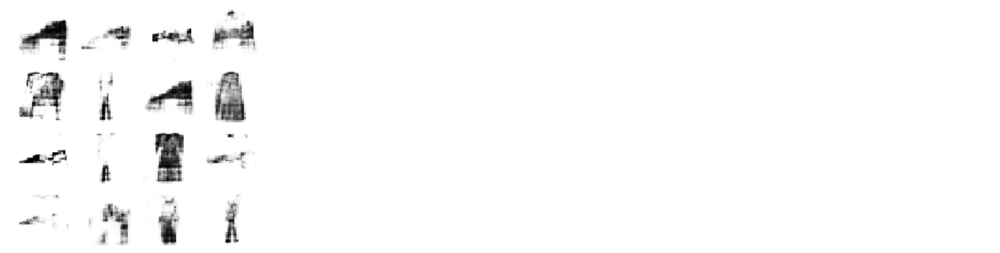

# Proposal 

## Motivation

In this project we will solve problem of generating images from text description by Deep Convolutional 
Generative Adversarial Network (GAN). Today GANs are very interesting field of research, because they 
belong to the set of generative models. It means that they are able to generate new content, what is 
kind of magic. We know about using of GANs in several fields, but creating new images from text 
description is an exciting idea in computer science today. 

Creating images from text has many real life application. It enables for example creating new characters
in cartoons or video games, drawing illustration into the books, or even creating phantom images of 
criminals according to witnesses' description. 

## Related work

Generating images according to text description is mainly reached by GANs, but the existing models often 
suffer from training problems because of instability and mode collapse. However, new and new approaches are
developing, and nowadays we are able to generate photorealistic images from short text description.

The paper [1] talks about training a deep convolutional generative adversarial net-work (DC-GAN) conditioned 
on text features.

In [2] two neural networks were used, where the first layer creates an image with primitive shapes 
and colors according to text description, and the second layer creates a surprisingly realistic images.


To solve the problems with instability during the training process it's possible to use 
Multi-Scale Gradient Generative Adversarial Networks (NSG-GAN)[3]. This approach allows the flow of gradients from the
discriminator to the generator at multiple scales. 

Another improvement of GANs are Conditional generative adversarial networks (cGAN). In GANs there is no way
to control the types of images that are generated other than trying to figure out the 
complex relationship between the latent space input to the generator and the generated images.
By conditioning the cGAN model on additional information it is possible to direct the data generation process, so we have
better control over the types of generated images.[4]
 
## Datasets

We identified several datasets with available data for our experiments. Datasets usually contains images with objects 
and theirs labels or text description. We will describe then more precisely below. 

- COCO dataset [5] (Common Objects in Contest) contains more than 200K labeled images,
 around 1.5 million object instances and 5 captions per image in average.

- Open images [6] is a huge dataset from Google with 
9M images with huge diversity, often with complex scenes and several objects. This dataset offers visual 
relationship annotation as well, indicating pairs of objects on the images, for example "beer on table".
There are 329 relationship triplets with almost 400 000 samples.

- Flowers [7] a dataset of 102 flower categories, where each class
consist of between 40 and 258 images per class. 


## High-Level Solution Proposal 

As we mentioned above, we will try to generate images from text. As architecture of the model we proposed Conditional 
generative adversarial network (cGAN) is an extension GAN. You can see the architecture on the picture bellow.

  

The architecture is comprised of generator and discriminator model. The generator model is responsible for 
generating new examples that ideally are indistinguishable from real examples in the dataset. 
The discriminator model is responsible for classifying a given image as either real
or fake (generated). Input to generator is vector that will be created from
random noise and Word2Vec encoding of image label or image description. This implementation will be build on top of 
[DCGAN in Tensorflow](https://www.tensorflow.org/tutorials/generative/dcgan). 

We plan build our model in experiments:
1. We will train prototype of model with Mnist dataset. This will be entry point that our model works properly.
2. In the next step we will prepare our data from either COCO or Openimage dataset. We will select images from set of 
several classes to avoid big complexity. Then we will tune and train our model to generate most reasonable images.
3. As a third experiment we would like to use data challenge from Openimage dataset. This challenge offers images with 
relations of two objects in image (man at horse, etc ...).  In case it wouldn't be out of scope we will implement 
generation of images with two objects.    


# Implementation

## Data analysis

We were working with Open Image dataset. 
Further analysis is accessible 
[here](https://github.com/FrantisekSefcik/NNets/blob/master/text_to_image/data/Data%20analysis.ipynb).

In our experiment we are using a subset of images, which are containing top 10 most frequent labels in 
relationship triplets.

## Data preprocessing

Because of the higher number of objects in image scenes we needed to simplify 
the images and work with fewer types of labels. We decided to cut out the objects from images 
according to defined bounding boxes. This approach gave us more samples with simpler composition,
which seemed be helpful by training.

Our preprocessing function has the following parameters/settings:

- relationships_location - path to csv file with object relationships 
- imgs_dir - path to directory with images
- label_codes_path - path to csv file with label codes
- labels - list of labels we are interested in, the function returns bounding boxes only with specified objects, 
if not defined, the top N most frequent labels are used
- top_n_labels - in case, that labels are not defined, the function works with most frequent labels, this parameter 
defines the number of labels
- number_of_images - number of images to be processed (we were working with 23 551 images with cca 200 000 labels,
we did not use all the images in every experiment)
- resize - defines, whether the image should be resized 
- size - defines the desired shape of the image after resizing
- interpolation - defines the interpolation mode used by image resizing
- normalize - defines, whether the image pixels should be normalized
- min - new min value in case of normalization
- max - new max value in case of normalization 
- norm_type - normalization type used by normalization 
- triplets - if true, relationship triplets are returned (for example 'Woman at Table'), in that case the returned image
is containing both objects. If false, every returned image contains one object's bounding box.

These settings allow us to easily try out more approaches and different preprocessing methods during our experiments. 

## Network architecture

In the picture you can see architecture of out conditional GAN. There is generator model which try to generate new 
images according to input labels and noise. We concat labels with noise after it is processed with embedding and dense
layers to achieve same shape.

Then we define discriminator which try to recognize if input image is fake or real. Labels are processed with embedding
and dense layers same as in generator. 

  

## Training pipeline

We have prepared base pipeline from loading data to training of conditional GAN.

#### Data loading
For easy data operation we have created function ```create_image_generator()``` placed in preprocessing.py file. This 
function is described in [Data preprocessing](#Data preprocessing). Images are preprocessed and have parameters which we 
define as arguments of function, so we can easily use them for training model.   

#### Networks model generation
For each training we create three models:
 * generator - generating of new images
 * discriminator - distinguishes ether generated image is fake or not
 * combined - generator and discriminator are combined to one model 
 
For clear defining of new models we created object ```GAN```, ```GANColor```, ```GanRGB``` objects that handle 
creating of these three models above according of input parameters: ```input_image shape, number of images classes, input_noise lenght ```.
All models are placed in [text_to_image/src/models/c_dcgan.py](https://github.com/FrantisekSefcik/NNets/blob/master/documents/Documentation.md)  

#### Training of model
For training we created script ```cDCGAN_train.py``` or jupyter notebooks, where we define all objects and 
hyper-parameters needs for training. We define number of epochs, batch size, atc. ```CGanTrainer``` is object placed 
in **train_helpers.py** file that contains many of methods needs for training, also it define train_step function for models.
Each trained model is saved in models folder.

#### Monitoring
We monitor training process with TensorBoard when we log loss values of all three models. Then we also log plot of 
new generated images for each epoch so we can control reliability of generated images.

* **logging** - graphs form tensorboard


* **images** - overview of generated images for each epoch in tensorboard

      


#### Evaluation

We decide to evaluate our results by manually visualization check. We compere generated images with expected samples and
discussed similarity and eventually improvements. For this evaluation task we prepared helper functions for generating and 
visualizing generated images. 

## Experiments

We divided all experiments to 4 stages:

### V1
[text_to_image/v1/dcgan](https://github.com/FrantisekSefcik/NNets/blob/master/text_to_image/v1/dcgan.ipynb)  

In the first stage we created basic GAN model for MNIST dataset with numbers. We wanted to learn same basic concepts of
GAN architecture. Also in this stage with basic model it was easier to set-up environment with Docker and create 
project structure.

All experiments for this stage are placed in **v1** folder. We successfully trained GAN model, that was able to generate 
reasonable images of numbers and also fashion mnist clothes as you can see in the picture.  
     

### v2
[text_to_image/v2/cDCGAN_mnist](https://github.com/FrantisekSefcik/NNets/blob/master/text_to_image/v2/cDCGAN_mnist.ipynb) 

In second stage we created conditional GAN and trained on fashion mnist dataset. For this experiment we met lots of 
problems to balance generator and discriminator to by trained. We had to define new way to train model and add more 
monitoring tools. 

At final we successfully trained model that was able to generate imeges according to input labels. Check the image, 
results are really similar to original images. 
  


### v3
[text_to_image/v3/cDCGAN_cifar](https://github.com/FrantisekSefcik/NNets/blob/master/text_to_image/v3/cDCGAN_cifar.ipynb) 

In this stage we created model able to generate RGB images. For the reason that our Openimage dataset has much more 
complex images we decided to use Cifar10 dataset. It was ideally choice, because there was only 10 classes and only 
one object per image.

Here we experiment with:

* Batch normalization
* Dropout layers
* Complex architecture
* Gaussian noise in discriminator
* Noise shape

We perform many different experiments in this stage to achieve best architecture to final stage. We trained model that
was able generate images with common shapes and colors for objects in class. In the picture you can see a car.  

  

  

### v4


## Evaluation


### References

[1] Reed, Scott, et al. ”Generative adversarial text to image synthesis.” arXiv preprint arXiv:1605.05396 (2016).

[2] Han Zhang, Tao Xu, Hongsheng Li, Shaoting Zhang, Xiaogang Wang, Xiaolei Huang, Dimitris Metaxas:
StackGAN: Text to Photo-realistic Image Synthesis with Stacked Generative Adversarial Networks, 
2017 IEEE International Conference on Computer Vision (ICCV), 2016

[3] Animesh Karnewar, Oliver Wang, Raghu Sesha Iyengar:
MSG-GAN: Multi-Scale Gradient GAN for Stable Image Synthesis,
ArXiv, 2019

[4] Conditional Generative Adversarial Nets,
Mehdi Mirza, Simon Osindero,
ArXiv, 6 Nov 2014

[5] http://cocodataset.org/#home

[6] https://storage.googleapis.com/openimages/web/index.htm

[7] http://www.robots.ox.ac.uk/~vgg/data/flowers/102/