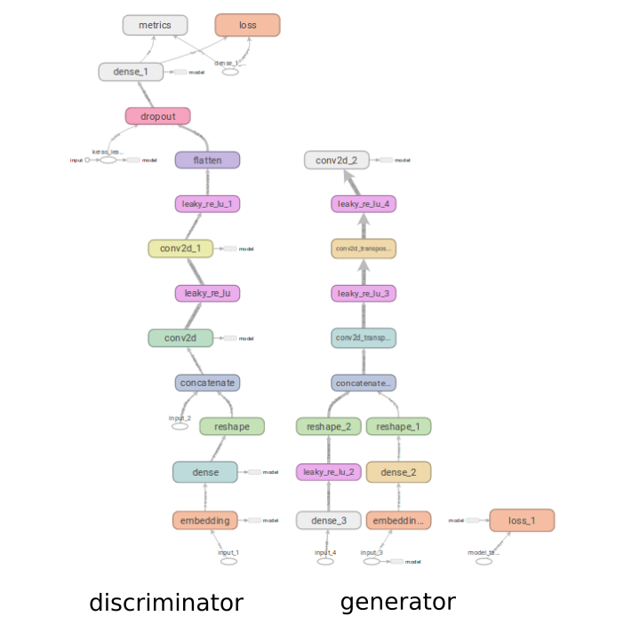

## Architecture of our conditional GAN network

* input_2 - new generated image
* input_1 - label of image
* input_3 - label of image
* input_4 - random noise



### Data analysis
Our data analysis is here: https://github.com/FrantisekSefcik/NNets/blob/analysis/text_to_image/data/Data%20analysis.ipynb

### Pipeline

We have prepared base pipeline from loading data to training of conditional GAN.

#### Data loading
For easy data operation we have created function ```create_image_generator()``` placed in preprocessing.py file. This 
function return generator for batches of images and their labels. Images are preprocessed and have parameters which we 
define as arguments of function, so we can easily use them for training model.   

#### Networks model generation
We create three model:
 * generator - generating of new images
 * discriminator - distinguishes ether generated image is fake or not
 * combined - generator and discriminator are combined to one model 
 
For clear defining of new models we created object ```GANColor``` that is responsible for creating af these three models
according of input parameters: ```input_image shape, number of images classes, input_noise lenght ```.
Models are placed in  

#### Training of model
For training we created script ```cDCGAN_train.py```, where we define all objects and hyper-parameters needs for
training. We define number of epochs, batch size, atc. ```CGanTrainer``` is object placed in train_helpers.py file that 
contains many of methods needs for training, also it define train_step function for models. In final we save generator 
model.

##### Monitoring
We monitor training process with TensorBoard when we log loss values of all three models. Then we also save image of 
new generated images so we can control reliability of generated images.

* logging

* images
        

